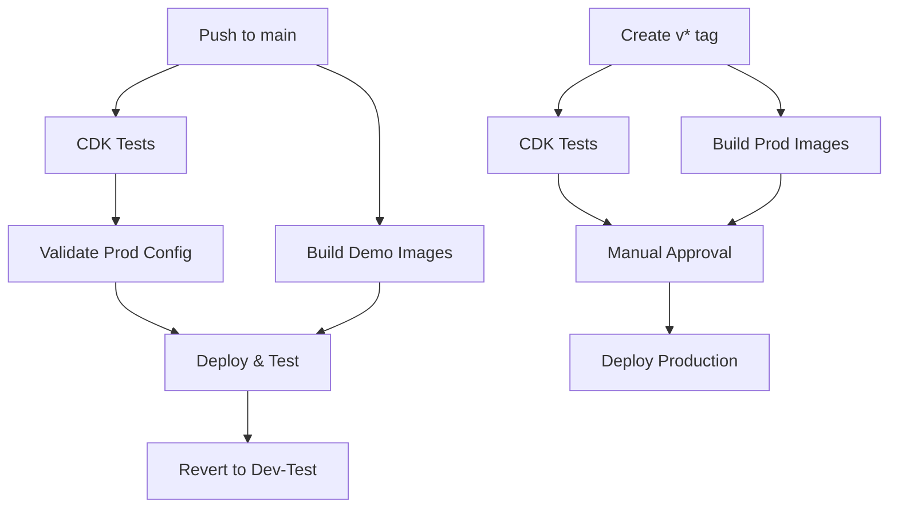

# AWS GitHub Actions Setup for AuthInfra

This guide covers setting up GitHub Actions for the AuthInfra repository, building on the base infrastructure already configured in BaseInfra.

## Prerequisites

**⚠️ Important:** Steps 1-2 from the [BaseInfra AWS GitHub Setup](https://github.com/TAK-NZ/base-infra/blob/main/docs/AWS_GITHUB_SETUP.md) must be completed first:
- Route 53 DNS setup
- GitHub OIDC Identity Provider and IAM roles

## 3. GitHub Environment Setup for AuthInfra

### 3.1 Create Environments

In your AuthInfra GitHub repository, go to **Settings → Environments** and create:

1. **`production`** environment
   - **Protection rules:**
     - Required reviewers: Add team leads
     - Wait timer: 5 minutes
     - Deployment branches and tags: Select "Selected branches and tags"
       - Add rule: "v*" (for version tags like v1.0.0)

2. **`demo`** environment
   - **Protection rules:**
     - Deployment branches and tags: Select "Selected branches and tags"
       - Add rule: "main"

> **Note:** The organization variables and secrets configured in BaseInfra will be used for both environments.

## 4. Branch Protection Setup

**Configure branch protection for `main`** to ensure only tested code is deployed:

1. Go to **Settings → Branches → Add rule**
2. **Branch name pattern**: `main`
3. **Enable these protections:**
   - ☑️ Require a pull request before merging
   - ☑️ Require status checks to pass before merging
     - ☑️ Require branches to be up to date before merging
     - ☑️ Status checks: Select "Test CDK code" after first workflow run

## 5. Breaking Change Detection for AuthInfra

### 5.1 AuthInfra-Specific Breaking Changes

**Critical resources that trigger breaking change detection:**
- PostgreSQL database cluster replacements
- Redis cluster replacements
- EFS file system replacements
- Application Load Balancer replacements
- Secrets Manager secret deletions

### 5.2 Implementation

AuthInfra uses the same breaking change detection system as BaseInfra:

1. **Stage 1 (PR Level)**: CDK diff analysis during pull requests - fast feedback
2. **Stage 2 (Deploy Level)**: CloudFormation change set validation before demo deployment - comprehensive validation

### 5.3 Override Mechanism

To deploy breaking changes intentionally:

1. **Include `[force-deploy]` in commit message**
2. **The workflows will detect the override and proceed with deployment**
3. **Use with caution** - ensure dependent stacks are updated accordingly

## 6. GitHub Actions Workflows

### 6.1 Workflow Architecture



### 6.2 Demo Testing Workflow (`demo-deploy.yml`)

**Triggers:**
- Push to `main` branch
- Manual dispatch

**Jobs:**
1. **test**: Run CDK unit tests and linting
2. **build-images**: Build Docker images for demo environment
3. **validate-prod**: Validate production configuration (runs in parallel)
4. **deploy-and-test**: Deploy with prod profile and run tests
5. **revert-to-dev-test**: Always revert to dev-test configuration

**Flow:**
```
Push → [Tests + Build Images + Validate Prod] → Deploy & Test → Revert
```

### 6.3 Production Deployment Workflow (`production-deploy.yml`)

**Triggers:**
- Version tags (`v*`)
- Manual dispatch

**Jobs:**
1. **test**: Run CDK unit tests
2. **build-images**: Build Docker images for production (calls production-build.yml)
3. **deploy-production**: Deploy to production with built images (requires approval)

**Flow:**
```
Tag v* → [Tests + Build Images] → Deploy Production
```

### 6.4 Build Workflows

**Demo Build (`demo-build.yml`):**
- Triggers on push to main (docker/ or cdk.json changes)
- Uses organization variables for demo environment
- Uses `dev-test` context from cdk.json
- Pushes to demo ECR repository

**Production Build (`production-build.yml`):**
- Triggers only on version tags (`v*`)
- Uses organization variables for production environment
- Uses `prod` context from cdk.json
- Pushes to production ECR repository

### 6.5 Required Organization Secrets and Variables

**Organization Secrets (configured in BaseInfra):**

| Secret | Description | Used For |
|--------|-------------|----------|
| `DEMO_AWS_ACCOUNT_ID` | Demo AWS account ID | Demo environment |
| `DEMO_AWS_ROLE_ARN` | Demo GitHub Actions IAM role ARN | Demo environment |
| `DEMO_AWS_REGION` | Demo AWS deployment region | Demo environment |
| `PROD_AWS_ACCOUNT_ID` | Production AWS account ID | Production environment |
| `PROD_AWS_ROLE_ARN` | Production GitHub Actions IAM role ARN | Production environment |
| `PROD_AWS_REGION` | Production AWS deployment region | Production environment |

**Organization Variables (configured in BaseInfra):**

| Variable | Description | Used For |
|----------|-------------|----------|
| `DEMO_STACK_NAME` | Stack name suffix for demo | Demo environment |
| `DEMO_TEST_DURATION` | Test wait time in seconds | Demo environment |
| `DEMO_R53_ZONE_NAME` | Demo Route53 zone name | Demo environment |

**AuthInfra-Specific Variables:**

Add these variables to the organization variables in GitHub:

| Variable | Description | Example |
|----------|-------------|----------|
| `DEMO_AUTHENTIK_ADMIN_EMAIL` | Admin email for demo | `admin@demo.tak.nz` |
| `PROD_AUTHENTIK_ADMIN_EMAIL` | Admin email for production | `admin@tak.nz` |

**Workflow Configuration:**
- All workflows use organization secrets and variables
- Production build workflow uses `prod` context from cdk.json
- Demo workflow uses `dev-test` context from cdk.json

## 7. Composite Actions

### 7.1 Setup CDK Environment Action

Location: `.github/actions/setup-cdk/action.yml`

**Purpose:** Reduces code duplication by consolidating common setup steps:
- Repository checkout
- Node.js setup with npm caching
- AWS credentials configuration
- Dependency installation

**Benefits:**
- Consistent setup across all workflows
- Easier maintenance and updates
- Reduced workflow file size
- Centralized Node.js and AWS configuration


## 8. Verification

Test the AuthInfra setup:

1. **Demo Testing:** Push to `main` branch → Should deploy demo with prod profile → Wait → Run tests → Revert to dev-test profile
2. **Production:** Create and push version tag (e.g., `v1.0.0`) → Should require approval → Deploy after approval

### 8.1 Deployment Flow

**Main Branch Push:**
```
Push to main → Tests → Demo (prod profile) → Wait → Tests → Demo (dev-test profile)
```

**Version Tag Push:**
```
Tag v* → Tests → Production (prod profile) [requires approval]
```

**Benefits:**
- Cost optimization: Demo runs dev-test profile between deployments
- Risk mitigation: Both profiles tested in demo before production
- Separation: Independent workflows for demo testing vs production deployment

## 9. Troubleshooting

### 9.1 Common Workflow Issues

**Workflow Failures:**

| Issue | Symptoms | Solution |
|-------|----------|----------|
| **Missing Secrets** | `Error: Could not assume role` | Verify organization secrets are set correctly |
| **Missing Variables** | `Error: Required variable not set` | Ensure organization variables are configured |
| **Breaking Changes** | Workflow stops at validation | Use `[force-deploy]` in commit message or fix changes |
| **Image Build Fails** | Docker build errors | Check Dockerfile and build context |
| **CDK Synthesis Fails** | `cdk synth` command fails | Verify cdk.json context values |
| **Deployment Timeout** | Job runs for hours | Check AWS resources and add timeout settings |
| **Composite Action Error** | `Can't find action.yml` | Ensure checkout step runs before composite action |

### 9.2 AuthInfra Specific Issues

**Common AuthInfra Problems:**

- **Authentik Version Mismatch:** Ensure Authentik version in cdk.json matches available Docker image
- **Database Connection Issues:** Verify PostgreSQL cluster is accessible and credentials are correct
- **Redis Connection Issues:** Check Redis cluster connectivity and security groups
- **Load Balancer Issues:** Verify ALB target group health and certificate configuration
- **OIDC Configuration:** Check Authentik OIDC provider settings and client configurations
- **EFS Mount Issues:** Verify EFS mount points and access points are correctly configured
- **Secrets Manager Issues:** Check that secrets are properly created and accessible

**Troubleshooting Steps:**

1. Check Authentik version in cdk.json
2. Verify stack status in CloudFormation console
3. Review stack events for specific error messages
4. Confirm ECR images are built and tagged correctly
5. Test database connectivity through AWS console
6. Verify Redis cluster status and endpoint
7. Check ECS service logs for container startup issues

### 9.3 Breaking Change Detection

**Understanding Breaking Changes:**

The system detects these critical changes:
- Database cluster replacements
- Redis cluster modifications
- Load balancer changes
- Security group modifications
- EFS file system changes

**Override Process:**

1. **Review the change:** Understand impact and plan downtime
2. **Add override flag:** Include `[force-deploy]` in commit message
3. **Monitor deployment:** Watch for issues during deployment
4. **Verify functionality:** Test all services after deployment

### 9.4 Dependencies on BaseInfra

**Required BaseInfra Resources:**
- VPC and networking (subnets, security groups)
- ECS cluster and service discovery
- KMS keys for encryption
- Route 53 hosted zones
- S3 buckets for CDK assets and backups
- ECR repositories

Ensure BaseInfra is deployed and stable before deploying AuthInfra changes.