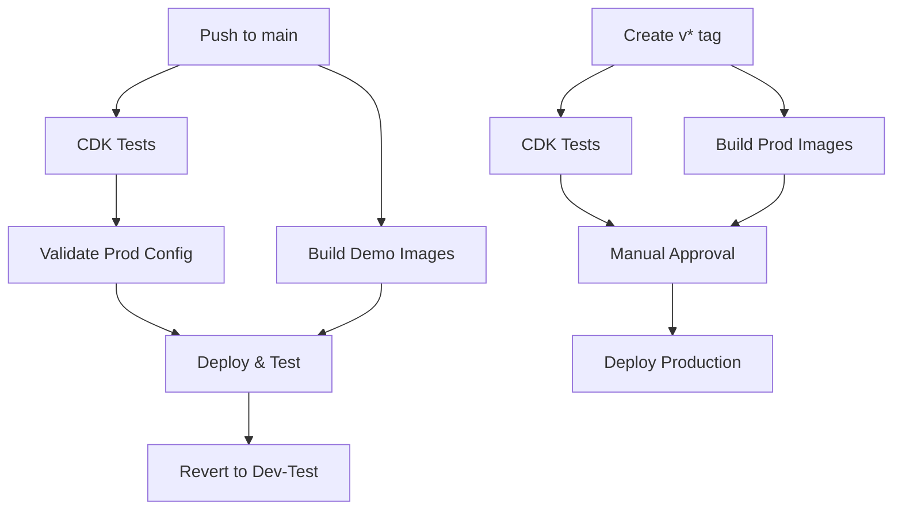

# AWS GitHub Actions Setup for AuthInfra

This guide covers setting up GitHub Actions for the AuthInfra repository, building on the base infrastructure already configured in BaseInfra.

## Prerequisites

**⚠️ Important:** Steps 1-2 from the [BaseInfra AWS GitHub Setup](https://github.com/TAK-NZ/base-infra/blob/main/docs/AWS_GITHUB_SETUP.md) must be completed first:
- Route 53 DNS setup
- GitHub OIDC Identity Provider and IAM roles

## 3. GitHub Environment Setup for AuthInfra

### 3.1 Create Environments

In your AuthInfra GitHub repository, go to **Settings → Environments** and create:

1. **`production`** environment
   - **Protection rules:**
     - Required reviewers: Add team leads
     - Wait timer: 5 minutes
     - Deployment branches and tags: Select "Selected branches and tags"
       - Add rule: "v*" (for version tags like v1.0.0)

2. **`demo`** environment
   - **Protection rules:**
     - Deployment branches and tags: Select "Selected branches and tags"
       - Add rule: "main"
   - **Environment variables:**
     - `DEMO_TEST_DURATION`: `300` (wait time in seconds, default 5 minutes)
     - `STACK_NAME`: `Demo`
     - `AUTHENTIK_ADMIN_EMAIL`: `admin@tak.nz`

### 3.2 Configure Environment Secrets

**For `production` environment:**
- `AWS_ACCOUNT_ID`: `111111111111`
- `AWS_ROLE_ARN`: `arn:aws:iam::111111111111:role/GitHubActions-TAK-Role`
- `AWS_REGION`: `ap-southeast-2`

**For `demo` environment:**
- `AWS_ACCOUNT_ID`: `222222222222`
- `AWS_ROLE_ARN`: `arn:aws:iam::222222222222:role/GitHubActions-TAK-Role`
- `AWS_REGION`: `ap-southeast-2`

## 4. Branch Protection Setup

**Configure branch protection for `main`** to ensure only tested code is deployed:

1. Go to **Settings → Branches → Add rule**
2. **Branch name pattern**: `main`
3. **Enable these protections:**
   - ☑️ Require a pull request before merging
   - ☑️ Require status checks to pass before merging
     - ☑️ Require branches to be up to date before merging
     - ☑️ Status checks: Select "Test CDK code" after first workflow run

## 5. Breaking Change Detection for AuthInfra

### 5.1 AuthInfra-Specific Breaking Changes

**Critical resources that trigger breaking change detection:**
- PostgreSQL database cluster replacements
- Redis cluster replacements
- EFS file system replacements
- Application Load Balancer replacements
- Secrets Manager secret deletions

### 5.2 Override Mechanism

To deploy breaking changes intentionally:

1. **Include `[force-deploy]` in commit message**:
```bash
git commit -m "feat: upgrade PostgreSQL engine version [force-deploy]"
```

2. **The workflows will detect the override and proceed with deployment**

## 6. GitHub Actions Workflows

### 6.1 Workflow Architecture



### 6.2 Demo Testing Workflow (`demo-deploy.yml`)

**Triggers:**
- Push to `main` branch
- Manual dispatch

**Jobs:**
1. **test**: Run CDK unit tests and linting
2. **build-images**: Build Docker images for demo environment
3. **validate-prod**: Validate production configuration (runs in parallel)
4. **deploy-and-test**: Deploy with prod profile and run tests
5. **revert-to-dev-test**: Always revert to dev-test configuration

**Flow:**
```
Push → [Tests + Build Images + Validate Prod] → Deploy & Test → Revert
```

### 6.3 Production Deployment Workflow (`production-deploy.yml`)

**Triggers:**
- Version tags (`v*`)
- Manual dispatch

**Jobs:**
1. **test**: Run CDK unit tests
2. **build-images**: Build Docker images for production
3. **deploy**: Deploy to production (requires approval)

### 6.4 Build Workflows

**Demo Build (`demo-build.yml`):**
- Triggers on push to main (docker/ or cdk.json changes)
- Uses `dev-test` context from cdk.json
- Pushes to demo ECR repository

**Production Build (`production-build.yml`):**
- Triggers only on version tags (`v*`)
- Uses `prod` context from cdk.json
- Pushes to production ECR repository

### 6.5 Required Secrets and Variables

**Environment Secrets (per environment):**

| Secret | Description | Example |
|--------|-------------|----------|
| `AWS_ACCOUNT_ID` | AWS account ID | `123456789012` |
| `AWS_ROLE_ARN` | GitHub Actions IAM role ARN | `arn:aws:iam::123456789012:role/GitHubActions-TAK-Role` |
| `AWS_REGION` | AWS deployment region | `ap-southeast-2` |

**Environment Variables:**

| Variable | Environment | Description | Example |
|----------|-------------|-------------|----------|
| `STACK_NAME` | demo, prod | Stack name suffix | `Demo`, `Prod` |
| `AUTHENTIK_ADMIN_EMAIL` | demo, prod | Admin email address | `admin@tak.nz` |
| `DEMO_TEST_DURATION` | demo | Test wait time in seconds | `300` |
| `R53_ZONE_NAME` | demo, prod | Route 53 zone name | `demo.tak.nz` |

## 7. Composite Actions

### 7.1 Setup CDK Environment Action

Location: `.github/actions/setup-cdk/action.yml`

**Purpose:** Reduces code duplication by consolidating common setup steps:
- Repository checkout
- Node.js setup with npm caching
- AWS credentials configuration
- Dependency installation

**Usage:**
```yaml
- name: Setup CDK Environment
  uses: ./.github/actions/setup-cdk
  with:
    aws-role-arn: ${{ secrets.AWS_ROLE_ARN }}
    aws-region: ${{ secrets.AWS_REGION }}
    role-session-name: GitHubActions-Demo
```

**Benefits:**
- Consistent setup across all workflows
- Easier maintenance and updates
- Reduced workflow file size
- Centralized Node.js and AWS configuration

## 8. Verification

Test the AuthInfra setup:

1. **Demo Testing:** Push to `main` branch → Should deploy demo with prod profile → Wait → Run tests → Revert to dev-test profile
2. **Production:** Create and push version tag:
   ```bash
   git tag v1.0.0
   git push origin v1.0.0
   ```
   → Should require approval → Deploy after approval

### 8.1 Deployment Flow

**Main Branch Push:**
```
Push to main → Tests → Demo (prod profile) → Wait → Tests → Demo (dev-test profile)
```

**Version Tag Push:**
```
Tag v* → Tests → Production (prod profile) [requires approval]
```

## 9. Troubleshooting

### 9.1 Common Workflow Issues

**Workflow Failures:**

| Issue | Symptoms | Solution |
|-------|----------|----------|
| **Missing Secrets** | `Error: Could not assume role` | Verify environment secrets are set correctly |
| **Breaking Changes** | Workflow stops at validation | Use `[force-deploy]` in commit message or fix changes |
| **Image Build Fails** | Docker build errors | Check Dockerfile and build context |
| **CDK Synthesis Fails** | `cdk synth` command fails | Verify cdk.json context values |
| **Deployment Timeout** | Job runs for hours | Check AWS resources and add timeout settings |

**Environment Setup Issues:**

```bash
# Verify environment variables
echo "Stack: ${{ vars.STACK_NAME }}"
echo "Email: ${{ vars.AUTHENTIK_ADMIN_EMAIL }}"

# Test AWS credentials
aws sts get-caller-identity

# Validate CDK context
npm run cdk context --clear
npm run cdk synth --context envType=demo
```

### 9.2 Deployment Issues

**Common CDK Deployment Problems:**

- **Resource Conflicts:** Check for existing resources with same names
- **Permission Issues:** Verify IAM role has required permissions
- **Network Issues:** Ensure VPC and subnets exist from BaseInfra
- **Image Pull Issues:** Verify ECR repository exists and images are pushed

**Debug Commands:**

```bash
# Check stack status
aws cloudformation describe-stacks --stack-name TAK-Demo-AuthInfra

# View stack events
aws cloudformation describe-stack-events --stack-name TAK-Demo-AuthInfra

# Check ECR images
aws ecr describe-images --repository-name tak-auth-infra

# Test image tags
VERSION=$(jq -r '.context."dev-test".authentik.authentikVersion' cdk.json)
echo "Expected tag: authentik-${VERSION}-tak-r1"
```

### 9.3 Breaking Change Detection

**Understanding Breaking Changes:**

The system detects these critical changes:
- Database cluster replacements
- Redis cluster modifications
- Load balancer changes
- Security group modifications
- EFS file system changes

**Override Process:**

1. **Review the change:** Understand impact and plan downtime
2. **Add override flag:** Include `[force-deploy]` in commit message
3. **Monitor deployment:** Watch for issues during deployment
4. **Verify functionality:** Test all services after deployment

**Example Override:**
```bash
git commit -m "feat: upgrade PostgreSQL to version 15 [force-deploy]

Breaking change: This will cause brief downtime during upgrade.
Tested in staging environment successfully."
```

### 9.4 Rollback Procedures

**Demo Environment Rollback:**
```bash
# Manual revert to previous version
git revert <commit-hash>
git push origin main

# Or redeploy specific version
npm run cdk deploy -- --context envType=dev-test
```

**Production Rollback:**
```bash
# Create rollback tag
git tag v1.0.1-rollback <previous-good-commit>
git push origin v1.0.1-rollback

# Or manual deployment
npm run cdk deploy -- --context envType=prod
```

### 9.5 Monitoring and Alerts

**Workflow Monitoring:**
- GitHub Actions tab shows all workflow runs
- Failed workflows send notifications to repository watchers
- Use GitHub CLI for programmatic monitoring:

```bash
# Check recent workflow runs
gh run list --limit 10

# View specific run details
gh run view <run-id>

# Download logs
gh run download <run-id>
```

**AWS Resource Monitoring:**
- CloudFormation stack events
- ECS service health checks
- Application Load Balancer target health
- RDS and Redis cluster status

### 9.6 Performance Optimization

**Workflow Speed Improvements:**
- Use npm cache in Node.js setup
- Parallel job execution where possible
- Skip unnecessary steps with path filters
- Use composite actions to reduce duplication

**Resource Optimization:**
- Right-size ECS tasks and RDS instances
- Use appropriate Redis node types
- Optimize Docker image sizes
- Enable CDK asset caching

### 9.7 Dependencies on BaseInfra

**Required BaseInfra Resources:**
- VPC and networking (subnets, security groups)
- ECS cluster and service discovery
- KMS keys for encryption
- Route 53 hosted zones
- S3 buckets for CDK assets and backups
- ECR repositories

**Verification Commands:**
```bash
# Check BaseInfra stack
aws cloudformation describe-stacks --stack-name TAK-Demo-BaseInfra

# Verify VPC exists
aws ec2 describe-vpcs --filters "Name=tag:Name,Values=TAK-Demo-VPC"

# Check ECS cluster
aws ecs describe-clusters --clusters TAK-Demo-Cluster
```

Ensure BaseInfra is deployed and stable before deploying AuthInfra changes.